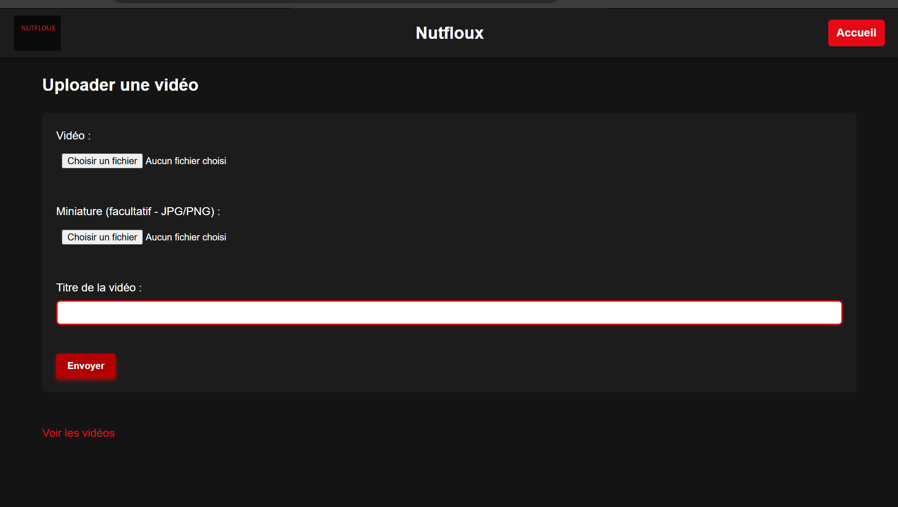
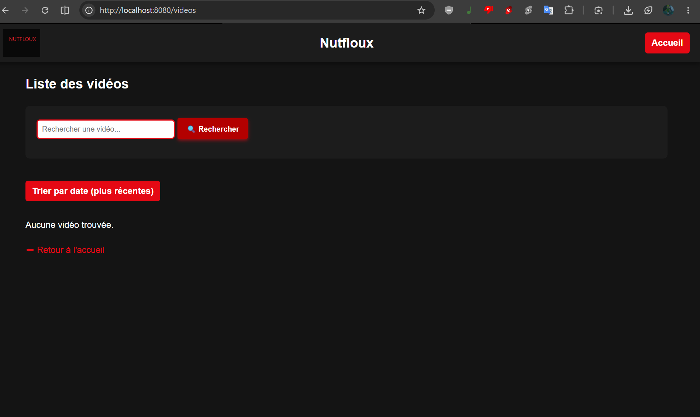

# Nutfloux (Mini-Netflix)

Application web de streaming vidéo simplifiée, développée avec Node.js, Express et EJS.
Elle permet d'uploader, afficher, trier et supprimer des vidéos dans une interface façon Netflix.

## Fonctionnalités

- Upload de vidéos avec titre et date d'ajout
- Miniatures (thumbnails) des vidéos
- Affichage avec tri par date (croissant / décroissant)
- Lecture d'une vidéo sur une page dédiée
- Suppression de vidéos

## Prérequis

- [Node.js](https://nodejs.org/) version la plus récente
- npm (fourni avec Node.js)
- Un navigateur web moderne (Chrome, Firefox, Edge, etc.)
- Un terminal pour exécuter les commandes
-[Git](https://git-scm.com/install/windows)  pour cloner le dépôt 

## Installation

```bash
git clone https://github.com/Xulyraide124/nutfloux.git
cd nutfloux
npm install
node app.js
```

L'application est ensuite accessible sur http://localhost:8080.

## Utilisation

1. **Ajouter une vidéo** : 
   - Cliquer sur le bouton "Ajouter une vidéo"
   - Remplir le formulaire avec le titre et sélectionner un fichier vidéo
   - Cliquer sur "Uploader" pour ajouter la vidéo à la liste
2. **Trier** : par date croissante ou décroissante
3. **Regarder** :   accéder à la page de lecture en cliquant sur la miniature de la vidéo
4. **Supprimer** :  supprimer une vidéo





## Structure du projet

```text
nutfloux/
├── app.js            # Serveur Express et routes
├── videos.json       # Stockage des métadonnées des vidéos
├── package.json      # Dépendances et scripts
├── public/           # Fichiers statiques (CSS, images)
├── thumbnails/       # Miniatures générées
└── views/            # Templates EJS
    ├── index.ejs
    ├── videos.ejs
    ├── player.ejs
    └── partials/header.ejs
```

## Stack technique

- Node.js, Express
- EJS (moteur de templates)
- <multer ou autre pour l'upload>
- Stockage dans un fichier JSON (pas de base de données)

## Auteurs

-  Ulysse ([@Xulyraide124](https://github.com/Xulyraide124))
